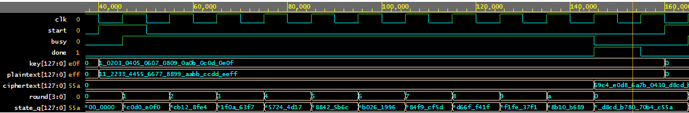

# AES-128 Core

A synthesizable AES-128 encryption core in SystemVerilog, verified with a
self-checking testbench, a UVM testbench, and bound SVA assertions.

The design follows FIPS-197. It encrypts one 128-bit block at a time using an
iterative datapath: one round per clock cycle, with the round keys generated on
the fly rather than precomputed and stored.

## Design

AES-128 maps a 128-bit plaintext to a 128-bit ciphertext under a 128-bit key.
It first XORs the plaintext with the key (the initial AddRoundKey), then runs
ten rounds over the 128-bit state. Each round is SubBytes, ShiftRows,
MixColumns, then AddRoundKey, and the last round skips MixColumns. After round
ten the state is the ciphertext.

```text
        plaintext           key
            │                │
            └─────> XOR <────┘     initial AddRoundKey:  state = plaintext XOR key
                     │
                     V
              ┌─────────────┐
        ┌────>│  state reg  │
        │     └──────┬──────┘
        │            │
        │            V
        │     ┌─────────────┐
        │     │  SubBytes   │
        │     └──────┬──────┘
        │            │
        │            V
        │     ┌─────────────┐
        │     │  ShiftRows  │
        │     └──────┬──────┘
        │            │
        │            V
        │     ┌─────────────┐
        │     │  MixColumns │       skipped on the last round
        │     └──────┬──────┘
        │            │
        │            V
        │     ┌─────────────┐      ┌──────────────┐
        │     │ AddRoundKey │<─────│ key schedule │   round key (new each round)
        │     └──────┬──────┘      └──────────────┘
        │            │
        │            ├──────────────> ciphertext      after round 10
        │            │
        └────────────┘   rounds 1-9: state loops back  (10 rounds, one per clock)
```

This core is *iterative* (folded): it builds one round in hardware and runs the
state register through it once per clock, reusing the same logic for all ten
rounds. A block therefore takes 11 clocks (one to load the input and add the
first key, then ten rounds), and only one block is in flight at a time. A single
round counter (0 = idle) sequences the rounds, so there is no separate state
machine, and the key schedule produces a fresh round key each clock, so the
round keys are never stored.

Each block transform is its own small module:

| Module            | Function                                               |
| :---------------- | :----------------------------------------------------- |
| `aes128_core`     | Top level: round counter, registers, handshake         |
| `aes_sbox`        | One-byte S-box (used by SubBytes and the key schedule) |
| `aes_sub_bytes`   | SubBytes over all 16 bytes                             |
| `aes_shift_rows`  | ShiftRows byte permutation                             |
| `aes_mix_columns` | MixColumns matrix multiply in GF(2^8)                  |
| `aes_key_expand`  | One step of the key schedule                           |

### Interface

| Signal       | Dir | Width | Description                                                             |
| :----------- | :-: | ----: | :---------------------------------------------------------------------- |
| `clk`        |  in |     1 | Clock                                                                   |
| `rst`        |  in |     1 | Synchronous reset, active high                                          |
| `clear`      |  in |     1 | Wipe key/state/ciphertext and abort a run (takes priority over `start`) |
| `start`      |  in |     1 | Pulse for one cycle while `busy` is low to start a block                |
| `plaintext`  |  in |   128 | Input block, sampled with `start`                                       |
| `key`        |  in |   128 | Cipher key, sampled with `start`                                        |
| `ciphertext` | out |   128 | Result, held until the next block or a `clear`                          |
| `busy`       | out |     1 | High while a block is in flight                                         |
| `done`       | out |     1 | One-cycle strobe when `ciphertext` is valid                             |

Bytes are big-endian: `plaintext[127:120]` is byte 0 of the state.

## Layout

```text
rtl/      RTL modules (aes128_core + transforms)
tb/       aes128_tb.sv      self-checking testbench, no UVM
          uvm/              UVM env, one class per file
eda/      aes128_rtl.sv     all RTL in one file (EDA Playground design pane)
          aes128_uvm_tb.sv  UVM env in one file (EDA Playground testbench pane)
formal/   aes128_props.sv   SVA assertions, bound to the core
docs/     waveform image and UVM-run logs shown in this README
```

## Simulating

The self-checking testbench runs the FIPS-197 and SP 800-38A known-answer
vectors and checks the handshake. With Verilator:

```sh
verilator --binary --timing --assert -Wno-fatal -o sim \
  rtl/*.sv formal/aes128_props.sv tb/aes128_tb.sv --top-module aes128_tb
./obj_dir/sim
```

Expected output:

```text
AES-128 known-answer vectors:
  ok   FIPS-197 C.1     69c4e0d86a7b0430d8cdb78070b4c55a
  ok   all-zero         66e94bd4ef8a2c3b884cfa59ca342b2e
  ok   all-ones         bcbf217cb280cf30b2517052193ab979
  ok   SP800-38A.1      3ad77bb40d7a3660a89ecaf32466ef97
  ok   SP800-38A.2      f5d3d58503b9699de785895a96fdbaaf
Handshake / control:
  ok   busy low when idle
  ok   clear wipes ciphertext

PASS: all checks passed
```

Adding `--trace` writes `aes128_tb.vcd`, which opens in GTKWave.



## Verification

The core is checked three ways, each independent of the design itself:

- **Known-answer vectors.** The self-checking testbench runs the core against
  the published FIPS-197 and SP 800-38A vectors, with the expected ciphertexts
  generated independently in OpenSSL.
- **UVM.** A self-contained UVM environment (driver, monitor, scoreboard,
  sequences). It comes two ways: `tb/uvm/` is the canonical layout (one class
  per file), and `eda/aes128_uvm_tb.sv` is the same env concatenated into a
  single file for EDA Playground. One environment serves
  two tests, picked at run time with `+UVM_TESTNAME` so nothing is recompiled:
  - `aes_directed_test` drives the published vectors.
  - `aes_random_test` drives constrained-random key/plaintext blocks.

  Because random stimulus has no precomputed answer, the scoreboard predicts the
  expected ciphertext with a behavioral AES-128 reference model (independent of
  the RTL) and compares against the DUT. The directed test, where the inputs are
  the known NIST vectors, validates the model and the DUT at the same time.
- **Assertions.** `formal/aes128_props.sv` binds a set of SVA properties to the
  core (done only after start, single-cycle done, ciphertext stability, clear
  wipes state). They are checked during simulation and are written to hold under
  a formal tool as well.

Line coverage (Verilator `--coverage`) reaches 100% on the synthesizable RTL;
the only unexercised lines are the testbench's own error and timeout branches.

On EDA Playground, paste `eda/aes128_uvm_tb.sv` into the testbench pane and
`eda/aes128_rtl.sv` into the design pane, then set the `+UVM_TESTNAME` plusarg
(`aes_directed_test` or `aes_random_test`) in the run-options field.

Both tests pass on Aldec Riviera-PRO (UVM 1.2). Trimmed output:

```text
[RNTST] Running test aes_directed_test...
[SCB] PASS cipher=66e94bd4ef8a2c3b884cfa59ca342b2e
[SCB] PASS cipher=bcbf217cb280cf30b2517052193ab979
[SCB] PASS cipher=69c4e0d86a7b0430d8cdb78070b4c55a
[SCB] PASS cipher=3ad77bb40d7a3660a89ecaf32466ef97
[SCB] PASS cipher=f5d3d58503b9699de785895a96fdbaaf
[SCB] DONE: 5 passed, 0 failed          UVM_ERROR: 0   UVM_FATAL: 0

[RNTST] Running test aes_random_test...
[SCB] PASS cipher=a0e3cea841ad5a897eebaf47af573cbe
[SCB] PASS cipher=10476da6a56dd7c4199b2d5be73972b5
... 18 more random blocks ...
[SCB] DONE: 20 passed, 0 failed         UVM_ERROR: 0   UVM_FATAL: 0
```

Full simulator logs: [docs/uvm_directed.log](docs/uvm_directed.log) and
[docs/uvm_random.log](docs/uvm_random.log).

## Synthesis

The RTL elaborates to gates with the open-source Yosys flow (sv2v lowers the
SystemVerilog first):

```sh
mkdir -p build
sv2v rtl/*.sv > build/aes128.v
yosys -p "read_verilog build/aes128.v; synth -top aes128_core -flatten; stat"
```

With no target cell library this is a generic mapping: roughly 10.5K cells, 389
registers (the three 128-bit datapath registers plus the round counter), and a
longest path of 21 logic levels, which is one AES round, as expected for the
folded datapath. This is a synthesizability check, not a placed-and-routed
implementation.

## Limitations

This is a functional core. Its runtime is data independent (always 11 cycles),
so it does not leak timing, but it has no power or electromagnetic side-channel
protection: the S-box is a plain table with no masking. It is meant for learning
and functional use, not for deployment against an attacker with physical access.
AES-128 only; no decryption.

## Reference

FIPS-197, *Advanced Encryption Standard*. Test vectors from FIPS-197 Appendix C
and NIST SP 800-38A. Licensed under MIT (see `LICENSE`).
