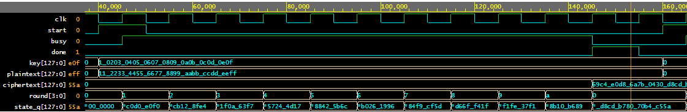

# AES-128 Core

A synthesizable AES-128 encryption core in SystemVerilog, following FIPS-197,
with an AXI4-Lite wrapper so it can sit on a bus as a memory-mapped
peripheral. Verified with self-checking testbenches, a UVM testbench, and
bound SVA assertions.

## Design

AES-128 maps a 128-bit plaintext to a 128-bit ciphertext under a 128-bit key.
It first XORs the plaintext with the key (the initial AddRoundKey), then runs
ten rounds over the 128-bit state. Each round is SubBytes, ShiftRows,
MixColumns, then AddRoundKey, and the last round skips MixColumns. After round
ten the state is the ciphertext.

```text
   plaintext      key
       |           |
       +--> XOR <--+             initial AddRoundKey
             |
             v
      +-------------+
 +--->|  state reg  |
 |    +-------------+
 |           |
 |           v
 |       SubBytes
 |           |
 |           v
 |       ShiftRows
 |           |
 |           v
 |       MixColumns              (skipped in round 10)
 |           |
 |           v
 |       AddRoundKey <-------- key schedule (next round key each clock)
 |           |
 |           +---------------> ciphertext (after round 10)
 |           |
 +-----------+  rounds 1-9
```

The core is iterative: there is one round's worth of hardware, and the state
register goes through it once per clock. A block takes 11 clocks (one to load
the input and add the first key, then ten rounds) and only one block is in
flight at a time. This keeps the area down compared to unrolling all ten
rounds. Control is a round counter (0 = idle) rather than a separate state
machine, and the key schedule computes the next round key each clock, so round
keys are never stored.

Modules:

| Module            | Function                                               |
| :---------------- | :----------------------------------------------------- |
| `aes128_axil`     | AXI4-Lite slave wrapper: register map, irq             |
| `aes128_core`     | Cipher core: round counter, registers, handshake       |
| `aes_sbox`        | One-byte S-box (used by SubBytes and the key schedule) |
| `aes_sub_bytes`   | SubBytes over all 16 bytes                             |
| `aes_shift_rows`  | ShiftRows byte permutation                             |
| `aes_mix_columns` | MixColumns matrix multiply in GF(2^8)                  |
| `aes_key_expand`  | One step of the key schedule                           |

### Core interface

| Signal       | Dir | Width | Description                                                             |
| :----------- | :-: | ----: | :---------------------------------------------------------------------- |
| `clk`        |  in |     1 | Clock                                                                   |
| `rst`        |  in |     1 | Synchronous reset, active high                                          |
| `clear`      |  in |     1 | Wipe key/state/ciphertext and abort a run (takes priority over `start`) |
| `start`      |  in |     1 | Pulse for one cycle while `busy` is low to start a block                |
| `plaintext`  |  in |   128 | Input block, sampled with `start`                                       |
| `key`        |  in |   128 | Cipher key, sampled with `start`                                        |
| `ciphertext` | out |   128 | Result, held until the next block or a `clear`                          |
| `busy`       | out |     1 | High while a block is in flight                                         |
| `done`       | out |     1 | One-cycle strobe when `ciphertext` is valid                             |

Bytes are big-endian: `plaintext[127:120]` is byte 0 of the state.

### AXI4-Lite wrapper

`aes128_axil` puts the core behind a standard 32-bit AXI4-Lite slave port
(Xilinx-style `s_axi_*` names, active-low `s_axi_aresetn`), plus an `irq`
output. Software writes the key and plaintext, sets `START`, waits for `DONE`
(by polling or by interrupt), then reads the ciphertext.

| Offset      | Name     | Access | Description                                                       |
| :---------- | :------- | :----: | :---------------------------------------------------------------- |
| 0x00        | `CTRL`   |   W    | [0] `START` (ignored while busy), [1] `CLEAR`, both self-clearing |
|             |          |   RW   | [2] `IRQ_EN`: drive `irq` while `DONE` is set                     |
| 0x04        | `STATUS` |   R    | [0] `BUSY`, [1] `DONE` (cleared by the next `START` or `CLEAR`)   |
| 0x10 - 0x1C | `KEY0-3` |   W    | Key, write-only (reads return 0)                                  |
| 0x20 - 0x2C | `PT0-3`  |   RW   | Plaintext                                                         |
| 0x30 - 0x3C | `CT0-3`  |   R    | Ciphertext                                                        |

Word 0 of each block is the most significant (`KEY0` = `key[127:96]`), so a
test vector is written in the same order it's printed. `WSTRB` is honored on
the key and plaintext registers. `CLEAR` wipes the key and plaintext registers
as well as the core. Offsets 0x08 and 0x0C read as 0, and every response is
`OKAY`. The port decodes a 64-byte window (6 address bits); the interconnect
decodes the base address.

The slave handles one transaction at a time. On writes it waits until both
`AWVALID` and `WVALID` are high and accepts them together, which the AXI spec
allows and keeps the logic small. A typical driver:

```c
for (int i = 0; i < 4; i++) {
    AES->KEY[i] = key[i];
    AES->PT[i]  = pt[i];
}
AES->CTRL = AES_CTRL_START;
while (!(AES->STATUS & AES_STATUS_DONE))
    ;
for (int i = 0; i < 4; i++)
    ct[i] = AES->CT[i];
```

## Layout

```text
rtl/      RTL modules (aes128_axil wrapper, aes128_core + transforms)
tb/       aes128_tb.sv          self-checking testbench for the core, no UVM
          aes128_axil_tb.sv     self-checking testbench for the AXI4-Lite wrapper
          uvm/                  UVM env, one class per file
eda/      aes128_rtl.sv         all RTL in one file (EDA Playground design pane)
          aes128_uvm_tb.sv      UVM env in one file (EDA Playground testbench pane)
formal/   aes128_props.sv       SVA assertions, bound to the core
          aes128_axil_props.sv  AXI4-Lite protocol assertions, bound to the wrapper
docs/     waveform image and UVM-run logs shown in this README
```

## Simulating

The core testbench runs the FIPS-197 and SP 800-38A known-answer vectors and
checks the handshake. With Verilator:

```sh
verilator --binary --timing --assert -Wno-fatal -o sim \
  rtl/*.sv formal/*.sv tb/aes128_tb.sv --top-module aes128_tb
./obj_dir/sim
```

Expected output:

```text
AES-128 known-answer vectors:
  ok   FIPS-197 C.1     69c4e0d86a7b0430d8cdb78070b4c55a
  ok   all-zero         66e94bd4ef8a2c3b884cfa59ca342b2e
  ok   all-ones         bcbf217cb280cf30b2517052193ab979
  ok   SP800-38A.1      3ad77bb40d7a3660a89ecaf32466ef97
  ok   SP800-38A.2      f5d3d58503b9699de785895a96fdbaaf
Handshake / control:
  ok   busy low when idle
  ok   clear wipes ciphertext

PASS: all checks passed
```

Adding `--trace` writes `aes128_tb.vcd`, which opens in GTKWave.



The wrapper testbench runs the same way and prints the same kind of report:

```sh
verilator --binary --timing --assert -Wno-fatal --Mdir obj_axil -o sim \
  rtl/*.sv formal/*.sv tb/aes128_axil_tb.sv --top-module aes128_axil_tb
./obj_axil/sim
```

## Verification

There are three layers of checking.

**Known-answer tests.** `tb/aes128_tb.sv` (above) runs the FIPS-197 and
SP 800-38A vectors, with the expected ciphertexts cross-checked against
OpenSSL. `tb/aes128_axil_tb.sv` runs the same vectors through the AXI4-Lite
wrapper with a small task-based bus master, then tests the register map,
`irq`, `CLEAR`, and back-pressure on the response channels.

**UVM.** `tb/uvm/` has a small UVM environment (driver, monitor, scoreboard,
sequences), one class per file. `eda/aes128_uvm_tb.sv` is the same thing in a
single file for EDA Playground. There are two tests, selected with
`+UVM_TESTNAME`:

- `aes_directed_test` drives the published vectors.
- `aes_random_test` drives 20 random key/plaintext blocks.

Random inputs don't have a known answer, so the scoreboard computes the
expected ciphertext with a behavioral AES-128 model written separately from the
RTL (`tb/uvm/aes_ref_model.svh`). The directed test checks the model and the
DUT against NIST at the same time.

**Assertions.** `formal/aes128_props.sv` binds SVA properties to the core:
`done` only after a `start`, `done` is one cycle wide, `ciphertext` only
changes on `done` or `clear`, and `clear` zeroes the output.
`formal/aes128_axil_props.sv` checks the wrapper's side of the AXI4-Lite
protocol: `BVALID`/`RVALID` stay up with stable data until the master accepts
them, there is no response without a request, and the handshake outputs drop
in reset. They run during simulation with `--assert`, and are written so they
should also work in a formal tool.

Line coverage (Verilator `--coverage-line`) over the two self-checking
testbenches is 100% on the RTL.

To run the UVM tests on EDA Playground, paste `eda/aes128_rtl.sv` into the
design pane and `eda/aes128_uvm_tb.sv` into the testbench pane, pick a UVM 1.2
simulator, and add `+UVM_TESTNAME=aes_directed_test` (or `aes_random_test`) to
the run options.

Both tests pass on Aldec Riviera-PRO with UVM 1.2. From the logs:

```text
UVM_INFO @ 0: reporter [RNTST] Running test aes_directed_test...
[SCB] PASS cipher=66e94bd4ef8a2c3b884cfa59ca342b2e
[SCB] PASS cipher=bcbf217cb280cf30b2517052193ab979
[SCB] PASS cipher=69c4e0d86a7b0430d8cdb78070b4c55a
[SCB] PASS cipher=3ad77bb40d7a3660a89ecaf32466ef97
[SCB] PASS cipher=f5d3d58503b9699de785895a96fdbaaf
[SCB] DONE: 5 passed, 0 failed
UVM_ERROR :    0
UVM_FATAL :    0

UVM_INFO @ 0: reporter [RNTST] Running test aes_random_test...
[SCB] PASS cipher=a0e3cea841ad5a897eebaf47af573cbe
[SCB] PASS cipher=10476da6a56dd7c4199b2d5be73972b5
...
[SCB] DONE: 20 passed, 0 failed
UVM_ERROR :    0
UVM_FATAL :    0
```

Full logs: [docs/uvm_directed.log](docs/uvm_directed.log),
[docs/uvm_random.log](docs/uvm_random.log).

## Synthesis

The RTL elaborates to gates with the open-source Yosys flow (sv2v lowers the
SystemVerilog first):

```sh
mkdir -p build
sv2v rtl/*.sv > build/aes128.v
yosys -p "read_verilog build/aes128.v; synth -top aes128_core -flatten; stat"
```

With no cell library this is just a generic gate mapping, but it gives a rough
size: about 10.5K cells and 389 flops (state, key and ciphertext at 128 bits
each, the 4-bit round counter, and `done`). The longest path is 21 logic
levels, which is one full round. This only shows the design synthesizes; it
hasn't been through place and route.

With `-top aes128_axil` the wrapper comes to about 11.8K cells and 685 flops.
Most of the extra flops are the 128-bit key and plaintext registers the bus
writes into. The longest path is still the 21-level round, so the bus logic
doesn't limit the clock.

## Limitations

- Encryption only, AES-128 only. No decryption, no 192/256-bit keys.
- Every block takes exactly 11 cycles regardless of the data, so there's no
  timing leak, but there is no protection against power or EM side-channel
  attacks (the S-box is a plain lookup table, no masking). Don't use it
  anywhere an attacker could get physical access to the hardware.

## Reference

FIPS-197, *Advanced Encryption Standard*. Test vectors from FIPS-197 Appendix C
and NIST SP 800-38A. Licensed under MIT (see `LICENSE`).
